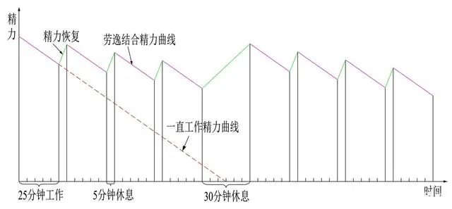
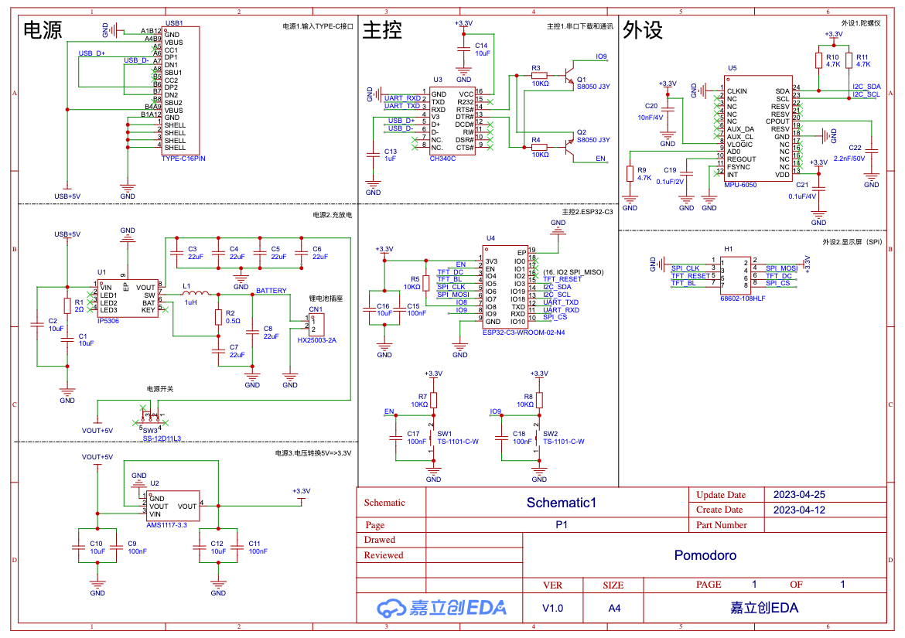

>
> 视频介绍：[不会闹铃的番茄时钟](https://www.bilibili.com/video/BV1qc411M7Mi/)
>

### 简介

想法来自“番茄（Pomodoro）工作法”，一种简单易行的时间管理方法。将时间划分为小块，包含专注的工作时间和发散的休息时间。劳逸结合的方式有利于获得较高的工作效率



### 特色功能

- 简单易用：翻转触发操作

- 劳逸结合：工作状态自动进入休息状态 + 不能关闭的窗口

- 减少干扰：自动开/关即时通讯软件（现支持微信/钉钉）

- 超长续航：长达10小时续航的锂电池，能满足一天的使用

- 插件机制：可以自己实现专用的状态显示效果，例如使用各种开发板附带的例子：点亮LED灯

### 客户端（client目录）

为了能跨平台使用，技术上选择了[Electron](https://www.electronjs.org)

- 编译/构建

	- 先安装[Node.js](https://nodejs.org/en/download)
	
	- 构建

		`npm run build`

- 调试

	由于UI的本质是一个Chrome浏览器，所以可以用Chrome的快捷键`Ctrl + Shift + I`/`Cmd + Opt + I`打开开发者工具
	
- 插件机制

	目录`src/notify-plugins`下新建一个js，模版如下，在感兴趣的状态事件中写相应代码即可
	
	```
	class NotifyPluginXXX {
    onWork() {
    }
    onBreak() {
    }
    onWorkEnd(force) {
    }
    onBreakEnd(force) {
    }
}
export default NotifyPluginXXX
	```

### 固件（fireware目录）

- 显示驱动：TFT_eSPI库

	Visual Studio Code + platformio的配置方法

	```
	配置文件`platformio.ini`增加`build_flags = -I include/tft`，然后`tft_setup.h`放在`include/tft`目录下
	```

- UI：LVGL库

	Visual Studio Code + platformio的配置方法

	```
	配置文件`platformio.ini`增加`build_flags = -I include/lvgl`，然后`lv_conf.h`放在`include/lvgl`目录下
	```

- 陀螺仪MPU6050：I2Cdevlib-MPU6050库

### 硬件（hardware目录）

芯片：USB TypeC接口，ESP32-C3蓝牙，MPU6050陀螺仪，CH340C串口，AMS-1117 3.3V电压转换，IP5306充放电

内容包括原理+PCB和BOM




### 外壳（3d-model目录）

注意外壳的尺寸是按显示屏和电池定制的，如果选择不同的电池（40x40x10mm）和显示屏（28x40mm）需要注意相应修改

### 注意事项

- ESP32-C3的内存不足

	由于显示屏/蓝牙/陀螺仪用去不少内存，LVGL界面的建议字体最大32，更大的字体容易引起crash（不断循环重启）

- 焊接PCB

	- 焊接IP5306时，底部GND需要焊接到焊盘，否则电压/电流不稳定引起一些奇怪的问题，例如电脑无法识别CH340芯片的串口。建议用风枪+锡膏

	- MPU6050是QFN封装，需要用风枪焊接

- 使用嘉立创EDA（专业版）

	用嘉立创的注意一下，设计时，库里提供的MPU6050是24根引脚，PCB布线时，有一个底部GND无法连接，删除后正常。实际使用下来，发现并不影响功能，主要应该是因为MPU6050本身有一个引脚已经连接到底部GND地线


